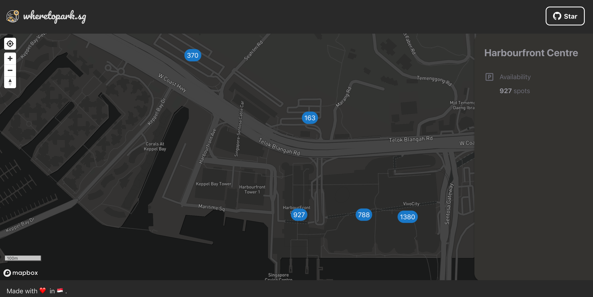
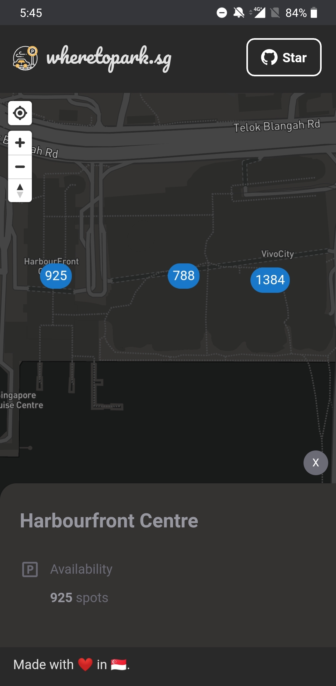

# Carpark Finder

[Carpark Finder](https://wheretopark.netlify.app/) is a simple web application aimed at creating a map-based tool for drivers in Singapore to find available parking lots easily.

 
Web
 

 
Mobile

## Technologies

- :atom_symbol: React (Front-End)
- [Netlify Functions](https://www.netlify.com/products/functions/) (Powered by AWS Lambda/ For backend tasks)
- [Mapbox](https://www.mapbox.com/) (3rd-Party Map Visualisation Service)
- [LTA DataMall API](https://www.mytransport.sg/content/mytransport/home/dataMall.html) (For real-time data on carpark availability)

## Features

- 📍 Find my location (This allows the user to pan and zoom the map to their current location to see the nearby carparks)
- 🅿️ Real-time parking availability data (Updated every 1 min)
